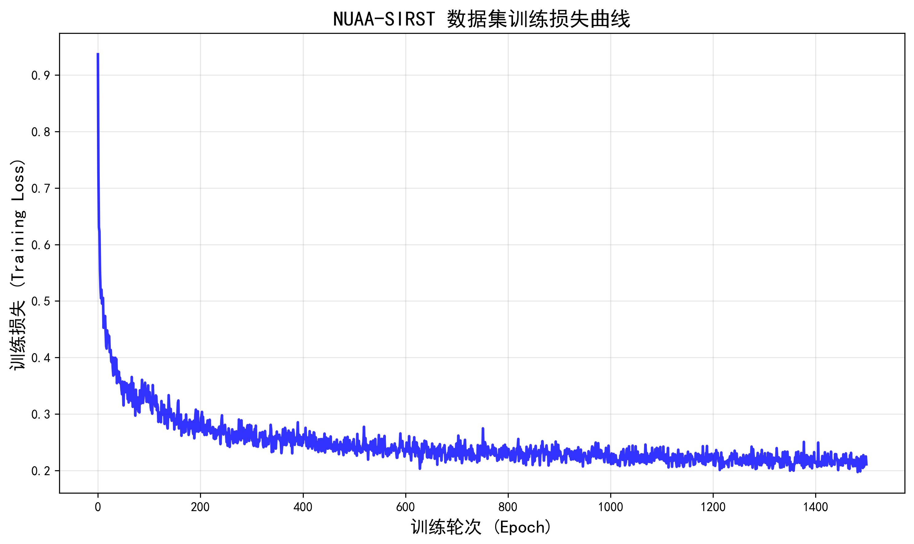
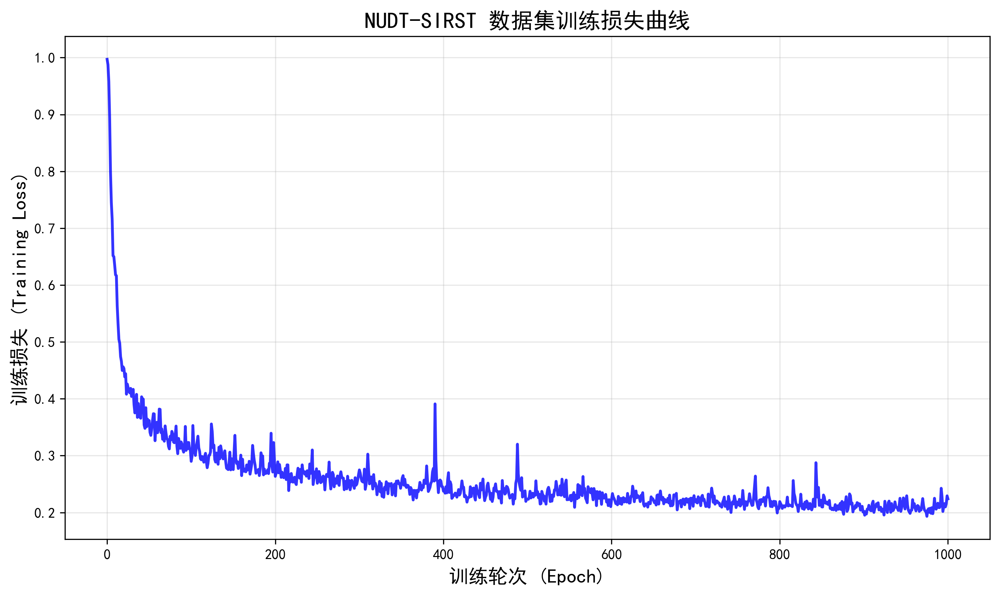

# DNANet Jittor Implementation

基于Jittor框架的DNANet红外小目标检测网络实现。

## 1. 环境要求

### 基础环境
- Python 3.7+
- CUDA 10.0+ (支持GPU训练)

### 依赖包
```bash
# 核心框架
jittor==1.3.1
numpy
scipy
scikit-image
Pillow
tqdm
```

### 安装命令
```bash
# 安装Jittor
pip install jittor==1.3.1

# 安装其他依赖
pip install numpy scipy scikit-image Pillow tqdm
```

## 2. 数据准备

### 自动化数据准备（推荐）

我们提供了自动化脚本来简化数据准备过程：

```bash
# 运行数据准备脚本
python setup_dataset.py
```

**脚本功能：**
- 🔍 自动检查数据集文件是否存在
- 📦 自动解压数据集压缩包
- 📁 自动创建标准目录结构
- 🔧 自动整理文件到正确位置
- ✅ 验证数据集结构完整性

**使用步骤：**
1. 手动下载数据集文件（见下方链接）
2. 将数据集文件重命名并放在项目根目录：
   - `NUDT-SIRST.zip`
   - `NUAA-SIRST.zip`
3. 运行脚本：`python setup_dataset.py`

### 手动数据集下载

**NUDT-SIRST数据集：**
- 下载链接：https://pan.quark.cn/s/c87c1148de39?pwd=AQtj
- 提取码：AQtj

**NUAA-SIRST数据集：** 
- 下载链接：https://pan.quark.cn/s/55066db3363d?pwd=DVb1
- 提取码：DVb1

### 数据集划分

本项目采用与DNANet源代码相同的数据集划分方式：
- **NUAA-SIRST**: 50%训练集 + 50%测试集
- **NUDT-SIRST**: 50%训练集 + 50%测试集

### 数据集文件结构


```
DNANet_Jittor_Implementation/
└── dataset/
    ├── NUAA-SIRST/
    │   ├── images/          # 原始红外图像 (.png)
    │   ├── masks/           # 真实标签图像 (.png)  
    │   ├── 50_50/           # 数据集划分文件
    │   │   ├── train.txt    # 训练集图像ID列表
    │   │   └── test.txt     # 测试集图像ID列表
    │   └── value_result/    # 测试结果保存目录
    └── NUDT-SIRST/
        ├── images/          # 原始红外图像 (.png)
        ├── masks/           # 真实标签图像 (.png)
        ├── 50_50/           # 数据集划分文件  
        │   ├── train.txt    # 训练集图像ID列表
        │   └── test.txt     # 测试集图像ID列表
        └── value_result/    # 测试结果保存目录
```

### 数据说明

- **images/**: 包含原始红外图像，格式为256x256像素的PNG文件
- **masks/**: 包含对应的二值化标签图像，目标区域为白色(255)，背景为黑色(0)
- **50_50/**: 数据集划分文件目录
  - **train.txt**: 训练集图像ID列表(不含扩展名)
  - **test.txt**: 测试集图像ID列表(不含扩展名)
- **value_result/**: 测试结果保存目录，存放PD_FA数据(.mat文件)和训练日志(epoch_continuous_log.txt)
- 数据集划分严格遵循DNANet原论文的设置，确保实验结果的可比性

## 3. 模型训练与测试

### 3.1 训练脚本使用

**基本训练命令：**
```bash
# 训练NUDT-SIRST数据集
python train.py --dataset NUDT-SIRST

# 训练NUAA-SIRST数据集  
python train.py --dataset NUAA-SIRST
```

**主要训练参数：**
- `--dataset`: 数据集名称 (NUDT-SIRST, NUAA-SIRST)
- `--epochs`: 训练轮次 (默认1500)
- `--train_batch_size`: 训练批次大小 (默认16)
- `--lr`: 学习率 (默认0.001)
- `--backbone`: 骨干网络 (resnet_18, resnet_34)
- `--channel_size`: 通道配置 (one, two, three, four)
- `--deep_supervision`: 是否使用深度监督 (True/False)
- `--optimizer`: 优化器 (Adam, Adagrad)
- `--scheduler`: 学习率调度器 (CosineAnnealingLR, ReduceLROnPlateau)

**自定义训练示例：**
```bash
# 使用ResNet-34骨干网络，四通道配置
python train.py --dataset NUAA-SIRST --backbone resnet_34 --channel_size four

# 调整学习率和批次大小
python train.py --dataset NUDT-SIRST --lr 0.0005 --train_batch_size 8

# 不使用深度监督
python train.py --dataset NUAA-SIRST --deep_supervision False
```

**训练输出：**
- 训练日志保存在 `result/{数据集}_{模型}_{时间戳}_wDS/` 目录
- 训练模型保存为 `mIoU_best.pth.tar`
- 训练过程日志：`epoch_continuous_log.txt`
- 指标记录：`best_iou_history.log`, `best_metrics_latest.log`

### 3.2 测试脚本使用

**基本测试命令：**
```bash
# 测试NUDT数据集训练的模型
python test.py --dataset NUDT-SIRST --st_model NUDT_BEST --model_dir NUDT_BEST/mIoU_best.pth.tar
```

**主要测试参数：**
- `--dataset`: 测试数据集名称
- `--st_model`: 模型标识名称 (用于结果文件命名)
- `--model_dir`: 预训练模型路径 (相对于result/目录)
- `--test_batch_size`: 测试批次大小 (默认1)
- `--ROC_thr`: ROC分析阈值数量 (默认10)

**测试特定训练结果：**
```bash
# 测试特定训练结果
python test.py \
    --dataset NUAA-SIRST \
    --st_model NUAA-SIRST_DNANet_20_07_2025_17_43_24_wDS \
    --model_dir NUAA-SIRST_DNANet_20_07_2025_17_43_24_wDS/mIoU_best.pth.tar
```

**测试输出指标：**
- **mIoU**: 平均交并比
- **PD**: 检测概率 (Probability of Detection)
- **FA**: 误报率 (False Alarm Rate)

## 4. 实验&性能日志

### 4.1 训练日志位置

训练过程中生成的所有日志文件保存在 `result/` 目录下，按以下格式组织：

```
result/
├── {数据集}_{模型}_{时间戳}_wDS/    # 训练结果目录
│   ├── epoch_continuous_log.txt     # 完整训练日志
│   ├── best_iou_history.log        # 最佳IoU历史记录  
│   ├── best_metrics_latest.log     # 最新最佳指标
│   └── mIoU_best.pth.tar          # 训练模型文件
└── {数据集}_BEST/                   # 最佳结果目录
    ├── epoch_continuous_log.txt     # 训练日志
    ├── best_iou_history.log        # IoU历史记录
    ├── best_metrics_latest.log     # 最佳指标记录
    └── mIoU_best.pth.tar          # 最佳模型文件
```

### 4.2 训练损失曲线

我们在NUAA-SIRST和NUDT-SIRST两个数据集上的训练结果如下：

#### NUAA-SIRST数据集训练损失



#### NUDT-SIRST数据集训练损失  



### 4.3 性能对比分析

我们基于**ResNet-18**骨干网络的Jittor实现与原始PyTorch实现的性能对比如下：

#### NUAA-SIRST数据集性能对比

| 实现方式 | mIoU (%) | PD (%) | FA |
|---------|----------|--------|-----|
| **Jittor实现 (Ours)** | **76.88** | **97.33** | **1.027×10⁻⁵** |
| PyTorch实现 | 77.47 | 98.48 | 2.353×10⁻⁶ |
| **性能差异** | **-0.59** | **-1.15** | **偏高** |

#### NUDT-SIRST数据集性能对比

| 实现方式 | mIoU (%) | PD (%) | FA |
|---------|----------|--------|-----|
| **Jittor实现 (Ours)** | **88.54** | **98.84** | **3.01×10⁻⁶** |
| PyTorch实现 | 87.09 | 98.73 | 4.223×10⁻⁶ |
| **性能差异** | **+1.45** | **+0.11** | **略优** |

**🎯 模型配置**：
- 骨干网络：ResNet-18
- 深度监督：启用 (wDS)


